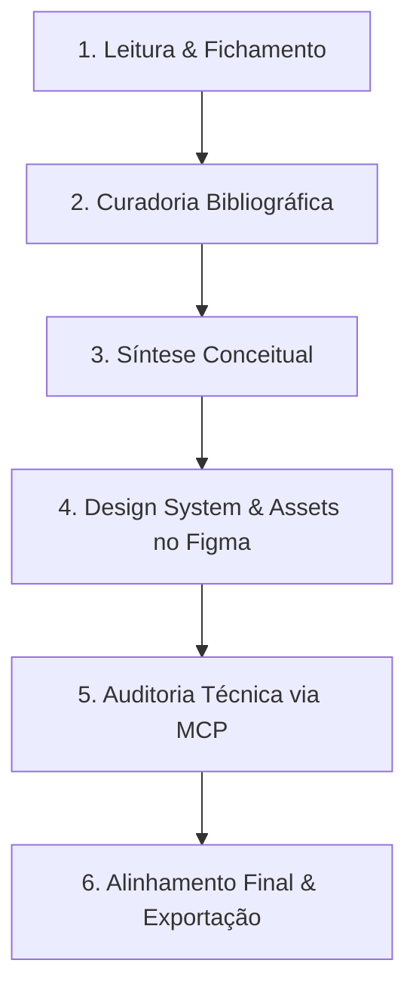

# Relatório de Processo e Declaração de Uso de Inteligência Artificial

**Atividade 01:** Compreendendo a Extensão Universitária  
**Projeto:** Projeto de Extensão CESUTech 2026/2 — Conectando Gerações e Impulsionando o Futuro e o Protagonismo Digital  
**Instituição:** UNICESUSC  
**Autor / Aluno:** Mateus Suman Carpenter  
**Questão Norteadora:** *“Por que uma universidade deve atuar diretamente na sociedade?”*  

---

## 1. Declaração Oficial de Uso de IA Generativa

> ### Declaração de Integridade Acadêmica e Uso de IA
> **Uso de IA:** O autor declara ter utilizado ferramentas de Inteligência Artificial Generativa — especificamente **Google Gemini / NotebookLM**, **GitHub Copilot**, **Claude** e **Google Antigravity** — como instrumentos de apoio metodológico para pesquisa exploratória, transcrição e fichamento de documentos em PDF, organização preliminar de ideias, apoio na estruturação visual/nomenclatura via protocolo MCP (Model Context Protocol) e revisão textual de documentação em Markdown.
>
> Todas as informações conceituais, normativas, dados empíricos e citações incorporados ao infográfico e aos documentos foram integralmente **verificados e validados pelo autor** a partir das fontes acadêmicas e legislações oficiais apresentadas nas referências (especialmente a Resolução CNE/CES nº 7/2018, o Parecer CNE/CES nº 608/2018 e artigos científicos indexados). A responsabilidade final pela exatidão, rigor ético e autoria do conteúdo é exclusivamente do autor.

---

## 2. Relação com os Critérios de Avaliação da Atividade

A tabela a seguir correlaciona os critérios estipulados para a avaliação da atividade com as etapas do processo de produção:

| Critério de Avaliação | Peso | Aplicação no Processo Desenvolvido |
| :--- | :---: | :--- |
| **Qualidade e confiabilidade da pesquisa** | **25%** | Leitura analítica e fichamento de legislações do MEC/CNE (Resolução 7/2018 e Parecer 608/2018) e artigos científicos revisados por pares (Fontenele 2024, Miguel 2023, Oliveira 2024), com checagem cruzada das referências citadas. |
| **Compreensão do conceito de Extensão Universitária** | **25%** | Delimitação rigorosa dos 9 eixos conceituais, superação explícita do viés assistencialista/voluntário e demonstração do princípio da indissociabilidade entre ensino, pesquisa e extensão (Art. 207 da CF/88). |
| **Capacidade de síntese e organização do infográfico** | **20%** | Estruturação de diagramação em 2 colunas com Auto Layout no Figma, separação visual equilibrada dos blocos, hierarquia tipográfica estrita (H1 a H4) e síntese conclusiva em 4 linhas (limite máximo de 5). |
| **Relação Universidade $\leftrightarrow$ Comunidade $\leftrightarrow$ Formação** | **15%** | Destaque visual e textual da "via de mão dupla", do protagonismo discente como agente ativo e da mútua transformação entre saberes acadêmicos e populares. |
| **Referências e integridade acadêmica** | **10%** | Normatização em padrão ABNT no rodapé do infográfico e rastreabilidade documental integral (tabela de pesquisa em `desenvolvimento.md`), acompanhada desta declaração formal de uso de IA. |
| **Apresentação do Time** | **5%** | Elaboração prévia de roteiro de oratória dividido minuto a minuto (pitch de 5 minutos) estruturado para defesa oral concisa e fundamentada. |

---

## 3. Pipeline Metodológico de Produção

O desenvolvimento do trabalho foi conduzido em etapas encadeadas, integrando pesquisa documental, engenharia de prompts assistida por IA, design visual no Figma e auditoria técnica de código e layout:

### Etapa 1: Leitura, Transcrição e Fichamento dos Materiais
- **Atividades:** Leitura aprofundada dos documentos orientadores da atividade e das fontes primárias disponibilizadas.
- **Ferramentas:** **Google Gemini / NotebookLM**.
- **Aplicação:** Transcrição e extração assistida de trechos essenciais de PDFs densos (legislações do CNE/MEC e artigos acadêmicos), gerando resumos preliminares e notas temáticas sem perda da terminologia técnica original.

### Etapa 2: Pesquisa e Curadoria Bibliográfica Cruzada
- **Atividades:** Busca por referências primárias e análise das referências das referências (rastreamento de fontes citadas nos artigos de base).
- **Resultado:** Identificação dos marcos históricos da extensão nos anos 1990 (FORPROEX 1998), fundamentação teórica de aprendizagem em ciclo duplo (Argyris & Schön) e seleção do caso prático real com metodologia PBL premiado pelo Sebrae (Oliveira, 2024).
- **Documentação:** Registro sistemático na Tabela de Pesquisa dos 9 eixos em [`desenvolvimento.md`](desenvolvimento.md).

### Etapa 3: Síntese Conceitual e Estruturação do Rascunho
- **Atividades:** Condensação dos conceitos em frases curtas de alto impacto visual, adequadas para a gramática de um infográfico de página única.
- **Ferramentas:** **NotebookLM / Gemini** para testes de condensação e redução textual.
- **Aplicação:** Redação da resposta norteadora de 4 linhas e delimitação dos eixos comparativos (Extensão Curricular vs. Voluntariado vs. Ação Assistencial).

### Etapa 4: Extração, Tratamento de Imagens e Criação de Assets
- **Atividades:** Criação dos vetores, ícones e diagramas esquemáticos representativos do Tripé Acadêmico, da Dinâmica Dialógica e da Troca de Saberes.
- **Ferramentas:** **Figma** e **NanoBanana** (tratamento de contraste, recorte e vetorização de imagens).
- **Resultado:** Banco de assets exportado e documentado em [`assets/componentes/README.md`](assets/componentes/README.md).

### Etapa 5: Nomenclatura e Banco de Fontes via MCP com GitHub Copilot
- **Atividades:** Padronização da biblioteca de estilos tipográficos e componentes de texto no Figma.
- **Ferramentas:** **GitHub Copilot** conectado via **Model Context Protocol (MCP)**.
- **Aplicação:** Apoio na organização sistemática dos estilos de texto em PascalCase e categorização dos textos do infográfico em biblioteca (`Biblioteca_Text_Components`).

### Etapa 6: Auditoria Estrutural e Boas Práticas no Figma via MCP (Antigravity & Claude)
- **Atividades:** Diagnóstico automatizado de camadas, verificação de hierarquia e refatoração de layout.
- **Ferramentas:** 
  - **Google Antigravity (com servidor MCP figma-developer):** Varredura da árvore de nós, detecção de sub-frames duplicados (`61:255`), identificação de camadas fora do frame (`68:93`) e validação de propriedades de layout.
  - **Claude (via MCP):** Suporte na refatoração para Auto Layouts estruturados (`Card_Comparativo_Extensao`, `Card_Tripe_Ensino`, etc.) e desvinculação de componentes indevidos em textos isolados.
- **Resultado:** Criação da página final de entrega **`resolucao`** com o frame `Infografico_Composicao_Horizontal` completamente limpo e padronizado.

### Etapa 7: Gestão do Repositório e Documentação Técnica
- **Atividades:** Documentação metodológica em Markdown, checklist de conformidade e controle de versionamento.
- **Ferramentas:** **Google Antigravity** e **GitHub Copilot**.
- **Aplicação:** Redação e formatação dos arquivos [`todo.md`](PIE/todo.md), [`desenvolvimento.md`](desenvolvimento.md), [`infografico.md`](infografico.md) e deste documento [`processo.md`](processo.md).

---

## 4. Resumo das Ferramentas Utilizadas

| Ferramenta | Categoria | Finalidade Principal no Projeto |
| :--- | :--- | :--- |
| **Google Gemini / NotebookLM** | IA Generativa / LLM | Fichamento de PDFs, extração de conceitos e apoio na síntese inicial. |
| **GitHub Copilot** | IA Generativa / Assistente de Código | Apoio na estruturação de dados e documentação Markdown. |
| **Google Antigravity** | Agente de IA / IDE | Inspeção técnica do Figma via MCP, diagnóstico de camadas e gestão do repositório. |
| **Claude** | IA Generativa / MCP | Orientação para aplicação de Auto Layout e boas práticas de Design System no Figma. |
| **Figma Desktop & Web** | Ferramenta de UI/Design | Vetorização, composição gráfica, diagramação e exportação final do infográfico. |
| **NanoBanana** | Processamento de Imagens | Tratamento de contraste, recorte e otimização visual dos assets gráficos. |

---

## 5. Conclusão sobre o Processo

O uso de ferramentas de Inteligência Artificial Generativa neste projeto atuou estritamente como **potencializador técnico e instrumental**, acelerando processos de transcrição, verificação de conformidade em design systems e organização de arquivos. 

Em nenhuma hipótese a IA substituiu o julgamento analítico, a fundamentação teórica nas fontes bibliográficas oficiais ou a responsabilidade ética do autor sobre as conclusões apresentadas no infográfico.
